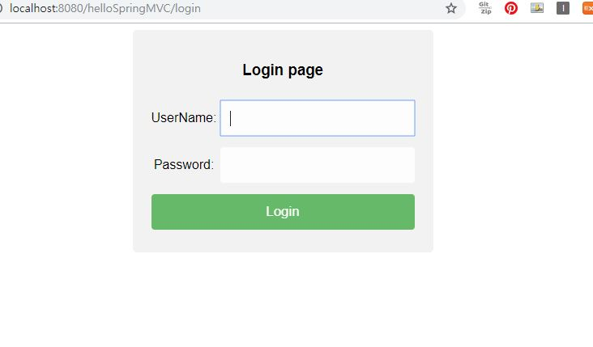
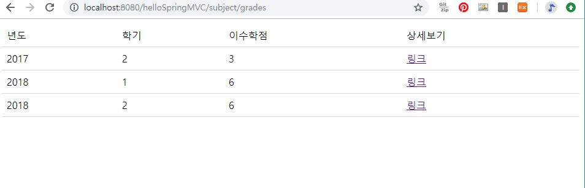
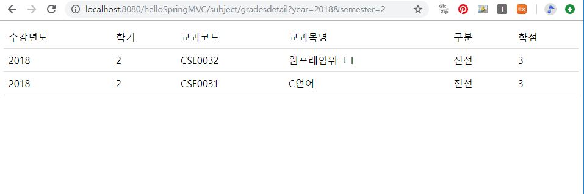
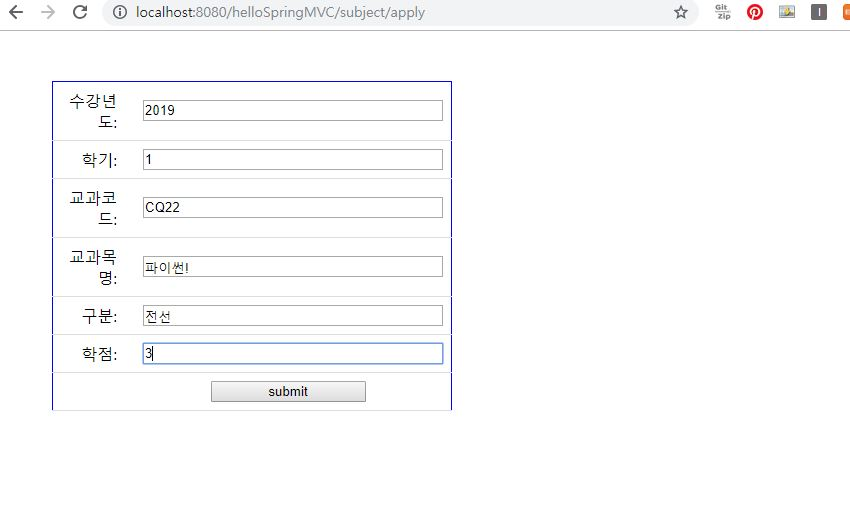
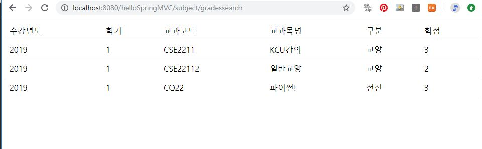

## SpringMVC_ClassRegistration

### ※주의사항 : 프로젝트의 jdbc.properties의 mysql 포트번호가 3307로 되어있습니다. 기존 포트설정을 하지 않은 사용자라면 3306으로 수정 후 사용하시길 바랍니다.
1. 로그인하기  
username과 password를 입력하면 로그인을 할 수 있습니다.  
  
2. 학기별 이수 학점 조회, 수강 신청하기, 수강 신청 조회 기능  
* 학기별 이수 학점 조회  
학기별 이수 학점 조회에 들어갔을시 2018년까지 DB에 저장된 내가 수강했던 과목들의 학점을 볼 수 있다.  
옆 링크를 클릭할 시 더 자세하게 모든 목록을 확인할 수 있다.  
  
    
* 수강 신청하기  
2019년에 수강할 과목을 신청할 수 있다.  
수강신청에 성공하면 DB에 등록된다.  
    
* 수강 신청 조회  
2019년 수강 신청한 과목을 확인할 수 있다.

